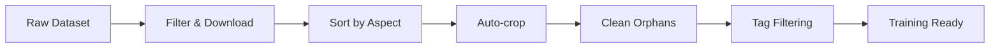

# LoRA Dataset Tools 🛠️

A comprehensive toolkit for **collecting, filtering, processing, and preparing image datasets** for LoRA, DreamBooth, and SDXL fine-tuning. Built specifically to work with [deepghs](https://huggingface.co/deepghs) datasets on Hugging Face.

## 🎯 Quick Overview

This toolkit provides a complete pipeline from raw dataset filtering to training-ready files:



## 📋 Table of Contents

- [Prerequisites](#prerequisites)
- [Installation](#installation)
- [Core Pipeline](#core-pipeline)
- [Advanced Tools](#advanced-tools)
- [Training Tools](#training-tools)
- [Utility Scripts](#utility-scripts)
- [Configuration Guide](#configuration-guide)
- [Troubleshooting](#troubleshooting)

## 🔧 Prerequisites

- **Python 3.10+** (3.11+ recommended)
- **CUDA-capable GPU** (for downloads and training)
- **Hugging Face account** with access token
- **Sufficient storage** (datasets can be 100GB+)

### Required Python Packages

```bash
pip install torch torchvision --index-url https://download.pytorch.org/whl/cu121
pip install transformers accelerate deepspeed
pip install polars pandas pyarrow
pip install pillow opencv-python
pip install huggingface-hub cheesechaser
pip install tqdm safetensors
```

## 🚀 Installation

```bash
# Clone the repository
git clone https://github.com/yourusername/LORA-tools.git
cd LORA-tools

# Create virtual environment (recommended)
python -m venv .venv
source .venv/bin/activate  # Linux/Mac
# or
.venv\Scripts\activate     # Windows

# Install dependencies
pip install -r requirements.txt
```

## 📊 Core Pipeline

### 1️⃣ Filter & Download Images

**Primary Scripts:**
- `Pullers/Rule34 puller.py` - Rule34 dataset filtering
- `Pullers/danbooru2024 puller.py` - Danbooru 2024 dataset filtering

**Features:**
- Advanced tag filtering with wildcards (`*cat*`, `dog*`, `*girl`)
- Score and rating filters
- Dimension filtering (square, min/max size)
- Efficient streaming with memory optimization
- Resume interrupted downloads
- Directory sharding for large datasets

**Quick Start:**
```bash
# Filter Rule34 dataset
python Pullers/Rule34\ puller.py \
    --include "1girl solo" \
    --exclude "multiple_girls nsfw" \
    --min-score 100 \
    --square \
    --min-square-size 1024 \
    --output ./my_dataset

# Danbooru 2024 dataset
python Pullers/danbooru2024\ puller.py \
    --include "*cat_ears" \
    --min-score 50 \
    --ratings safe general \
    --output ./danbooru_cats
```

### 2️⃣ Sort by Aspect Ratio

**Script:** `file sorting/sizesorter.py`

Separates non-square images and handles corrupted files:
- Moves non-1:1 aspect ratio images to separate folder
- Detects and handles corrupted/unreadable images
- Multi-threaded processing for speed
- Optional duplicate detection and removal

```bash
# Configure paths in the script, then run:
python file\ sorting/sizesorter.py
```

### 3️⃣ Auto-crop Images

**Script:** `Image edits/crop.py`

Generates centered 1:1 crops from large images:
- Multiple crops from wide/tall images with controlled overlap
- Preserves JSON metadata for each crop
- Configurable minimum size enforcement
- Graceful stop with hotkey support

```bash
# Edit paths in script, then run:
python Image\ edits/crop.py
```

### 4️⃣ Clean Dataset

**Script:** `file sorting/cleanup.py`

Removes orphaned files:
- Deletes images without corresponding JSON files
- Deletes JSON files without corresponding images
- Multi-threaded for large datasets

```bash
python file\ sorting/cleanup.py
```

### 5️⃣ Tag-based Cleanup

**Script:** `tag cleaner.py`

Remove images containing specific unwanted tags:
- Case-insensitive exact keyword matching
- Recursive directory scanning
- Safe preview before deletion

```bash
python tag\ cleaner.py
# Enter keyword when prompted (e.g., "watermark")
```

## 🎯 Advanced Tools

### Batch Rename & Tag Editing

**Script:** `Image edits/image_json_editor.py`

Batch rename image/JSON pairs and update metadata:
```bash
python Image\ edits/image_json_editor.py --commit --suffix "_processed"
```

### Dataset Format Conversion

**Script:** `danbooru json to highdream formats.py`

Convert Danbooru JSON format to training-friendly format:
- Combines artist and general tags
- Creates clean file_name, tags, caption structure
- Backs up original files safely

### CSV Tools

**Script:** `file sorting/json_to_csv.py`

Convert directory of JSON files to single CSV:
- Combines all JSON metadata into one file
- Handles nested directories
- Preserves all fields

## 🤖 Training Tools

### Camie-Tagger Dataset Builder

**Script:** `camie_tagger_dataset_builder.py`

Generate training datasets using pre-trained Camie-Tagger:

```bash
python camie_tagger_dataset_builder.py \
    --input-dir "/path/to/images" \
    --output-dir "/path/to/dataset" \
    --hf-token "hf_xxxxxxxxxx" \
    --confidence-threshold 0.35 \
    --batch-size 64 \
    --fp16
```

**Output:**
- `train_dataset.csv` - Training-ready CSV
- `images/` - Processed images
- `*.txt` - Caption files (optional)

### Camie-Tagger Fine-tuning

**Script:** `Training/Camie‑Tagger training.py`

Fine-tune Camie-Tagger on new images:

```bash
python Training/Camie‑Tagger\ training.py \
    --base_ckpt camie_v0.pt \
    --output_ckpt fine_tuned_camie.pt \
    --data_root ./new_training_data \
    --epochs 2.0 \
    --lr 1e-4
```

**Features:**
- Empirical Fisher EWC regularization
- Focal loss for class imbalance
- DeepSpeed ZeRO-2 support
- Replay training with legacy data

### Data Review Tools

**Script:** `Training/Data reviewer.py`

Interactive GUI for reviewing and editing tags:
- Tag-by-tag review interface
- Live preview of final output
- Undo/redo functionality
- Bulk editing support

## 🔨 Utility Scripts

### Database Tools

- `database/datasetbuilder.py` - Combine parquet shards
- `database/import pyarrow.py` - Inspect parquet schemas
- `collum output.py` - List parquet columns

### Data Analysis

- `Training/Delta of data.py` - Compare datasets and generate review files
- `beta pulled.py` - Legacy pulling script with different optimizations

## ⚙️ Configuration Guide

### Setting Up HuggingFace Authentication

1. Get your token from [HuggingFace Settings](https://huggingface.co/settings/tokens)
2. Set environment variable:
   ```bash
   export HF_TOKEN="hf_xxxxxxxxxxxxxxxxxx"
   ```
3. Or use `huggingface-cli login`

### Optimizing for Your System

#### Memory & Performance
- Adjust `batch_size` based on available RAM
- Set `workers` to match your CPU cores
- Use `--fp16` for GPU memory savings
- Configure `files_per_shard` for large datasets

#### Storage Configuration
```python
# In puller scripts, edit these paths:
metadata_db_paths = ["/path/to/your/metadata.parquet"]
output_dir = "/path/to/your/output"
```

### Common Filter Patterns

```python
# Quality filters
exclude_tags = [
    "lowres", "blurry", "jpeg artifacts",
    "watermark", "signature", "text",
    "bad anatomy", "bad hands",
    "ai generated", "ai_*"
]

# Content filters
include_tags = ["1girl", "solo"]  # Require ALL
include_tags = ["*cat*"]          # Wildcard matching
exclude_tags = ["multiple_girls", "nsfw"]

# Dimension filters
square_only = True
min_square_size = 1024
min_score = 50
ratings = ["safe", "general"]
```

## 🔍 Troubleshooting

### Common Issues

#### "No metadata files found"
- Check parquet file paths in config
- Verify files exist and are accessible
- Use `collum output.py` to inspect file structure

#### "HuggingFace authentication failed"
- Verify token has read permissions
- Check token isn't expired
- Try `huggingface-cli login`

#### "Out of memory during download"
- Reduce `batch_size` and `workers`
- Enable `--fp16` mode
- Use directory sharding

#### "Download fails/stalls"
- Check internet connection
- Reduce worker count
- Enable progress tracking

### Performance Tips

1. **SSD Storage**: Use SSD for working directory
2. **RAM**: 32GB+ recommended for large datasets
3. **CPU**: More cores = faster processing
4. **GPU**: Required for training, optional for filtering

### Debug Mode

Enable verbose logging:
```python
import logging
logging.basicConfig(level=logging.DEBUG)
```

## 📄 License

This project is licensed under the MIT License - see the LICENSE file for details.

## 🤝 Contributing

1. Fork the repository
2. Create feature branch (`git checkout -b feature/amazing-feature`)
3. Commit changes (`git commit -m 'Add amazing feature'`)
4. Push to branch (`git push origin feature/amazing-feature`)
5. Open Pull Request


---

**⚡ Happy Training!** Star ⭐ this repo if it helps with your AI projects!